# Assembly guide 🕐 1 to 3 hours

Okay, so you've got your package box. What now? First things first, let's see what you should have.

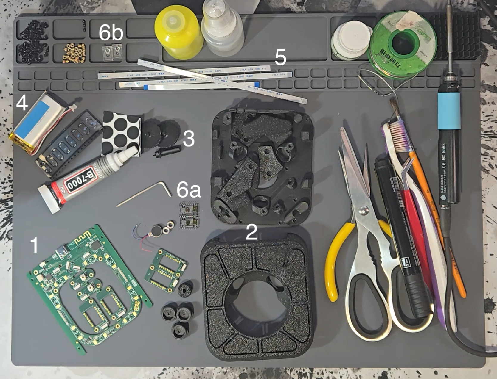

## Included in every kit

1) The PCB panel
2) FDM printed parts: shell, bottom part, 8 buttons, a fixture, and 3 adapters for static bearings.
3) SLA printed parts: two knobs and one guide for assembly.
4) Battery — although, for the sake of shipping safety, it will likely already be installed in its place.
5) Flat printed cables.
6) Two sets of PMW3610 sensors and their lenses.
   
...and the rest of small things: a vibration motor, two ball bearings, three static bearings, magnets, heat-set inserts, M2 screws, rubber feet, a hex key and a tube of glue. 

> [!NOTE]
> If your kit contains separate encoder boards, please dispose of the ones in the panel.
>
> If you purchased upgraded sensors, you will have two sets of sensor boards and lenses. The longer lenses belong to the PAW3395 boards.

## Required from your side

1. A flat, hard surface to work on. A 3D-printing bed is a nice option.
1. Pliers or scissors to pull off PCB break points
1. Soldering equipment
    1. A soldering iron
    1. Flux
    1. Solder
    1. IPA (isopropyl alcohol) for cleaning
1. Wipes (for IPA and excess glue)
1. A marker
1. A tiny flathead screwdriver for the screw terminal
1. Tweezers (optional, but very useful)

## Preparation

The very first thing to do is to depanelize the PCB: Hold it firmly and push at the center, between boards.

Make sure it bends in the right place when you are doing so.

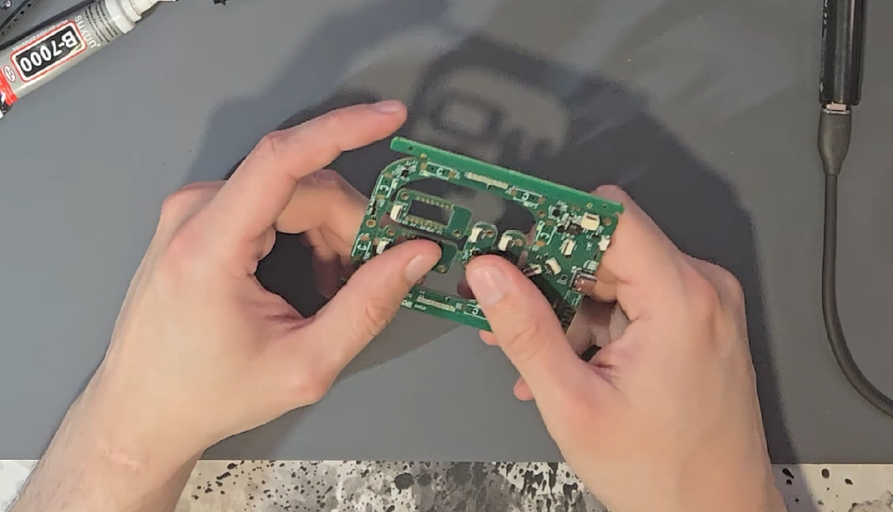

**🎥 Nervous about breaking the PCB? No need to fear, [check out this video to see some... "creative" ways of depanelizing.](./video/assembly/depanelization.mp4)**

Remove the excess tabs with pliers or whatever tool you have. Remove the two edge rails.

## Soldering

⏩ *If you have ordered the solderless option, you can skip to [gluing](#gluing).*

### Heat-set inserts

Now that you are prepared, let's heat up the soldering iron.

Take the **top part**—we will install heat-set inserts into the shell first.

Grab **five inserts** and place them into the appropriate holes. One of the sides is narrower; that's the part that goes in the hole. They should stay in place without you holding them.

If your iron lets you control the temperature, set it to **240°C or 460°F.**

If not, well, that's unfortunate, but it'll still work.

You need to push the insert gently with your soldering iron, while keeping it on its "trajectory".

Try to apply force just in one direction, vertical, in this case. It's like playing a violin. (I'm sure every one of you knows how to play the violin, so it's great to have such a nice comparison.)

Push them until they sit flush. The whole process should take just a few seconds.

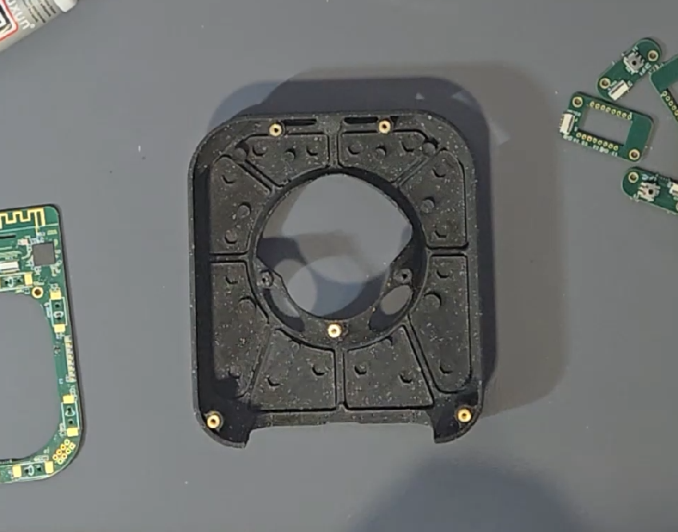

Now, do the same with 4 inserts for the **bottom part** (the picture shows two, hope you will forgive me).

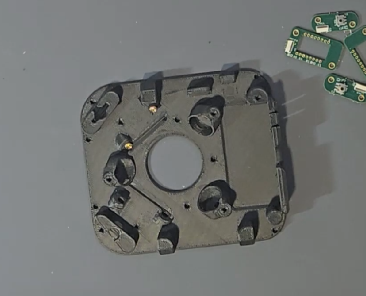

### Soldering sensors

Now that we're done with the inserts, let's move forward to the **sensors.**

Take one sensor, and visually locate the "PMW3610" text.

Take a **breakout board**, and insert the sensor so the FPC connector (white part) is on the bottom and the "PMW3610" text is on the top.

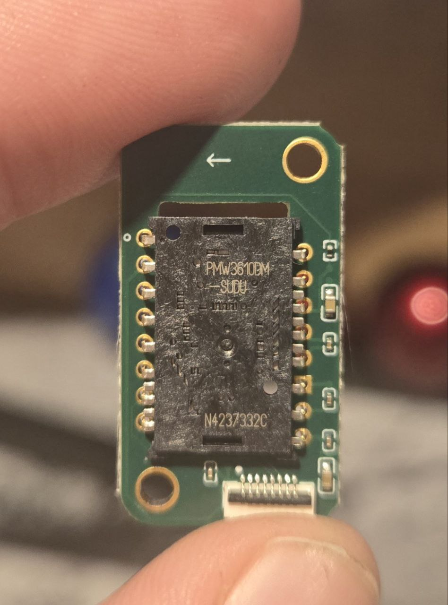

Now, turn it over, keeping the IC from falling out, and solder it down.

Do the same with the second sensor. Clean any residue off the boards with your IPA.

### Soldering the motherboard

Take the **motherboard**—we're going to solder your **microswitches** and install the **vibration motor screw terminal**.

Please be careful while soldering **microswitches**. Some pads have micro passives near them. It's easy to desolder one or several–*ask me how I know.* Desoldering may or may not be fatal—if it's a capacitor, you just lose hardware debounce functionality... if it's a resistor, the button is dead, and you need to either solder a new resistor or short the pads.

Now, keeping _that_ in mind, do the job: the silkscreen will guide you in terms of how to install the switches.

Next, solder down the **screw terminal** for the vibration motor. Note that it should be on the **bottom** of the PCB, not on top.

And that's all the soldering! You can turn your soldering iron off.

## Gluing

Glue is used to attach the lenses to the sensors, and the magnets to the buttons and keycaps.

You can open the glue by rotating the cap. When not in use, insert the pointy side of the cap into the hole to keep the glue fresh.

> [!TIP]
> B-7000 glue loves to leave glue strings everywhere. Fear not, they are easy to remove afterwards.
>
> Also, the glue is not instantaneous and takes 5-10 minutes to harden, giving you ample time to work.

### Gluing lenses to the sensors

Remove the pieces of yellow (Kapton) tape from the sensors, there are **two pieces on each sensor.**

Now, take a lens. The lens will only sit flat in one orientation. To figure out which, try both ways—a neat trick we've learned from USB!

> [!NOTE]
> After inserting the lens, plastic rods stick out of the IC at the bottom, and if you place the board onto a flat surface, your lens will push itself off. Find a small surface where it can sit without the rods getting pushed while the glue dries.

Make sure the lens sits flush or hold it in midair, and pour just a little bit of glue on each of the short sides, as indicated in the photo:

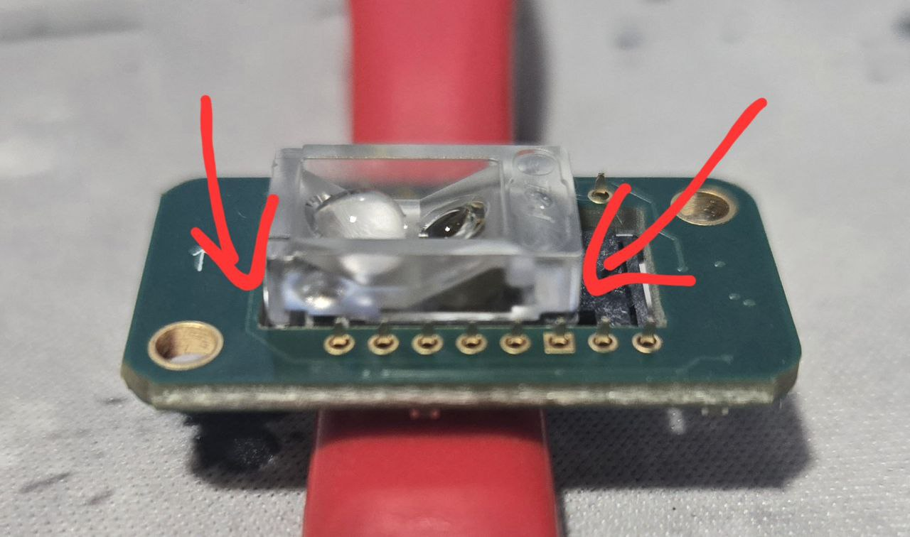

After applying glue, let the sensor boards rest for 10-15 minutes.

Alternatively, you can apply glue to the rods themselves (from the other side), but please make sure to wait for at least 30 minutes to allow them to dry fully.

### Gluing magnets on the keycaps

> [!NOTE]
> Gluing is recommended, but optional, for your keycaps. It's typically a tight fit.

Take all your **magnets** and make a single rod (tower) out of them. Mark one side, either with your marker or by putting a small piece of paper between the last two magnets.

_Always keep this side pointing upwards_, it will allow you to keep the polarity consistent.

Apply glue to all the holes in the **keycaps** (not the buttons yet).

Note: you don't need to _pour_ glue, just make little dabs.

Install magnets into the keycaps by pushing the tower into each hole and then moving it sideways. Remove excess glue with a wipe.

### Gluing magnets on the buttons

Take the **shell** and dab glue in each magnet hole.

Install magnets in this way:

1. Hold the shell, magnet holes facing up.
1. Roughly line up a keycap to its matching button.
1. Take one magnet and drop it into one of the button holes, it will orient itself to the right polarity.
1. Continue with the second hole.
1. Push the magnets firmly into their holes.
1. Repeat for all the buttons.

You're done with the magnets! You can put the glue away, you won't need it anymore.

Allow the glue to dry for 10-15 minutes before handling these parts.

## Cables

> [!CAUTION]
> Inserting a flat cable in the wrong way will be **fatal** for the sensor. Please ensure all your cables are installed identically, with the contact side on top / the blue tape side on the bottom.
> Again—**any flat printed cable must be installed in the way displayed in the photo below**.

Install the cables into the 4 daughter boards (2 encoder boards, 2 sensor boards), **with the contact side facing you**:

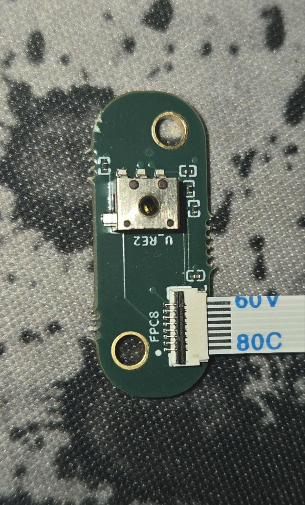

> [!TIP]
> The black thingy is a flip lock, flip it away from the cable for it to be in a horizontal position to lock the cable.  
> The connectors must be locked after inserting the cables for proper installation.

Take your **marker** and mark the other ends of the **sensor** cables.
The marking will help you to distinguish encoder and sensor cables.  (Don't skip this step as future you may regret it.)

## Rotary encoders and knobs

**🎥 There is a [video guide for this section.](./video/assembly/knobs.mp4)**

This next step will require a sacrifice. (Don't worry, none of your blood will be spilled, unless you're terrible with tweezers.)

Take the **bottom part** and locate the sacrificial layer—loose plastic strings in the holes for the encoder bearings.

Remove these with any method available. You don't need to be perfectly clean, just don't leave loose plastic.

| Bottom left | Bottom right |
|---|----|
|  |  |

Now that you've done that, place one of the encoder boards under a clear bearing hole (they slide in from the inside), 

Line up the screw holes and begin screwing them down, **but not fully**. Just a few rotations so that they can still wiggle.

Next, take the **guide** part. Insert it into the encoder and it should be able to rotate. This will center the encoder. Now you can tighten the screws! Be careful—when pulling the guide out, pull straight upward to avoid breaking it.

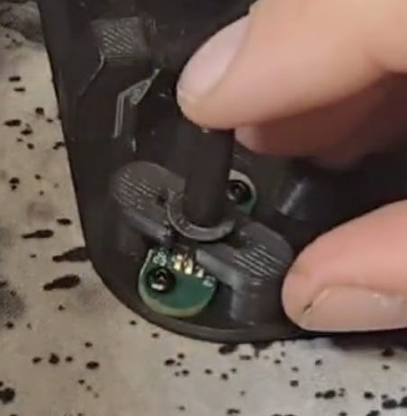

Repeat for the other encoder board.

Now, take **ball bearings** and the **knobs**.

Install the bearings onto the knobs, then place the knobs into the encoder, allowing the bearings to fall into place in the shell bearing holes.

Rotate the knobs to verify your positioning. If you don't hear satisfying clicks, repeat the positioning procedure.

If after several attempts you still get no clicks, try loosening both screws. You may leave them loose and it won't negatively affect functionality.

Remove the knobs for now.

## Installing sensors

Next, the **sensor boards**.

Put one in place, lining up the screws. **Ensure the arrow on it is pointing downward**. Screw it down while holding it gently from the top side (so it stays in its lowest position).

Do it again with the second one. That's it! Please refer to the photo below for the correct orientation and preferred cable management.

## Motherboard

Use the **screw terminal** to connect the **vibration motor**. Ensure the red wire goes into the + hole, and use a tiny flathead to screw each wire in place, with the stripped part of the wire making contact with the terminal.

Next, push **cable pairs** into the appropriate slots in the motherboard.
You want the blue stiff parts of the cables to face you while doing that:

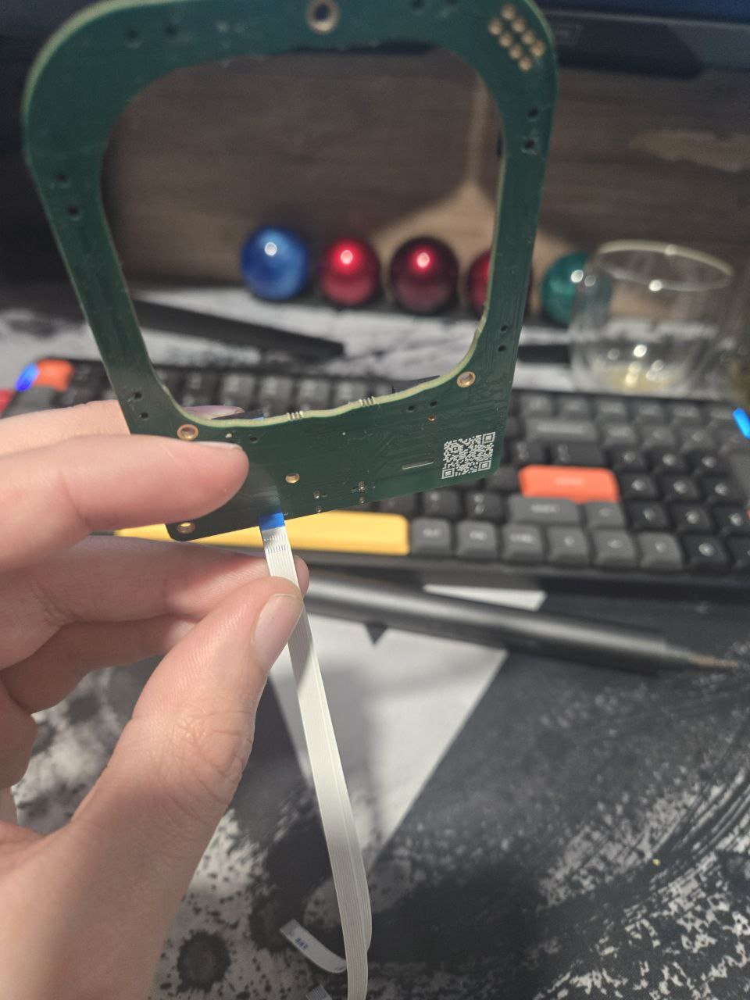

Connect the cables, and fix them in place.

Cables for the **sensors go straight**, those for the **rotary encoders go diagonally.**

Luckily, you have the sensor cables marked! Here's a photo with the correct wiring of the sensors:

Install the **encoder knobs.**

Now, place the **motherboard onto the bottom part**, ensuring that the cables do not interfere with the plastic features or the screw holes.

Screw down the motherboard, then peel the backing off the **motor** and place it onto the **vertical feature** sticking out on the left side of the bottom part. Make sure that the motor does not touch the "floor" (bottom surface); it should have at least 1 mm clearance.

Almost done!  

## Testing

> [!NOTE]
> In this photo, a cable is trapped beneath the PCB where the fourth screw should go (in the very top-left).  
> This is incorrect — ensure the PCB sits flush and no cables obstruct the screw hole.

Now is a great moment to test your assembly. Make sure it looks like this: 

Connect the battery cable and then connect the USB cable. You should see a new input device in your system.

> [!TIP]
> Please be aware that the motherboard will not get powered after connecting the battery alone.
> It is required to connect USB power to "bootstrap" the power distribution chip.  

## Shell and feet

Let's install the shell! Visually line up the holes and the knobs, then slide the shell onto the bottom part.

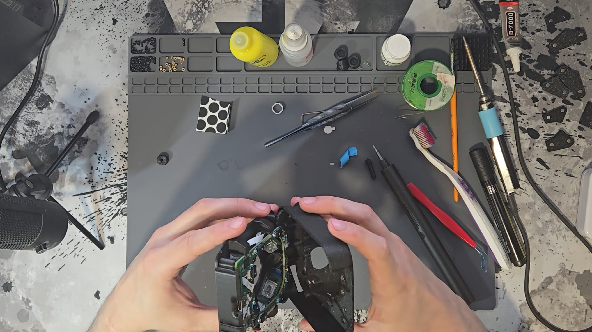
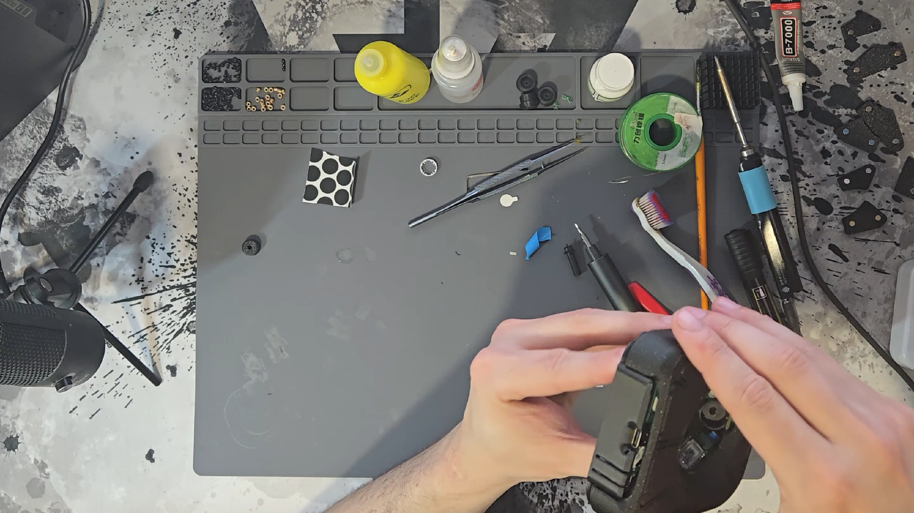

Turn it over, and screw it down: start with one of the bottom screws, continue with the opposite top screw and so on.

Install the rubber feet with the help of the visual guiding features.

## Installing static bearings in the adapters

Now, the last step—take your adapters for static bearings.
Here's what to do: place a bearing onto the side hole and push it inside with the hex key. (You cannot scratch the bearing because it's harder than the key.)

Now that it's inside, take a screw and tighten it from the bottom while keeping the side hole upward to keep the ball from moving sideways. 

## Inserting bearings

Install your bearings of choice (static bearings or BTUs) and keycaps — you're good to go!

> [!TIP]
> Please make sure your adapters or BTUs are inserted fully. It's a tight fit and might require some force.

## Use the device!

[Here's the default keymap](https://efog.tech/docs/keymap). You can install [ZMK Studio](https://zmk.studio/download) to reconfigure it, or just go ahead with using it as is.

It is highly recommended to either build a fresh firmware, or [download one*](https://efog.tech/products/endgame-trackball-complete-diy-kit?tab=links#content) from the product page, to ensure you have up-to-date bugfixes and updates. Also see:
1. [Troubleshooting](https://github.com/efogtech/endgame-trackball/blob/main/TROUBLESHOOTING.md)
2. [Marshmellow UI](https://efog.tech/marshmellow-ui) — configuration tool
3. [FAQ](https://github.com/efogtech/endgame-trackball/blob/main/FAQ.md)
4. [Discord server](https://efog.tech/discord)

> [!CAUTION]
> Please make sure to remove BTUs or static bearings every time you assemble or disassemble your device. There are diagonal holes on the bottom which you can use with the stock hex key to push them out. You will break either knobs or the shell if you leave them in place. 

*Please note that the upgraded sensors (PAW3395) require a [special firmware](https://github.com/efogtech/endgame-trackball-config/tree/paw3395)!

