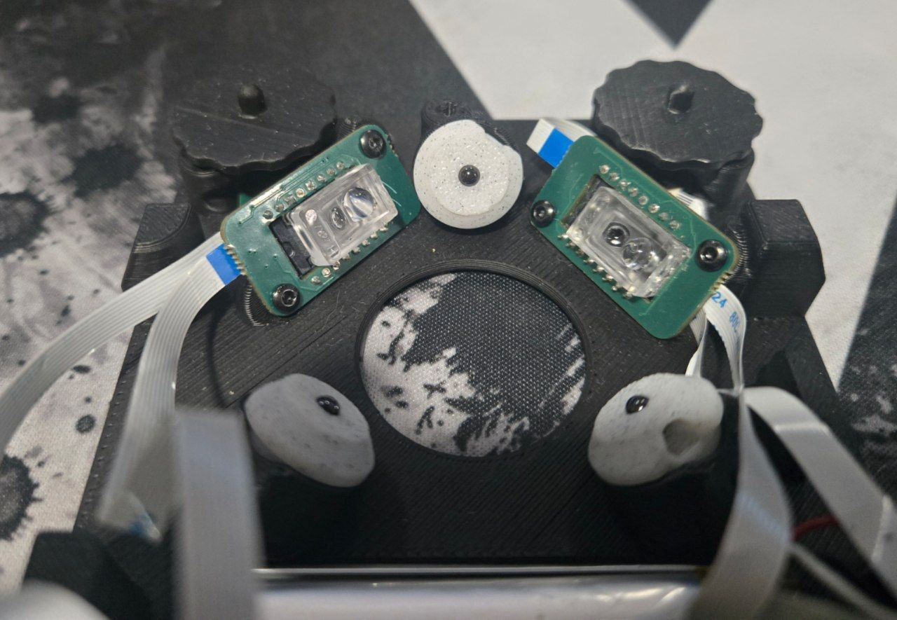

## Assembly guide

Okay, so you've got your package box. What now? First things first, let's see what you should have.

### Included to every kit
1) The PCB panel
2) FDM printed parts: shell, bottom part, 8 buttons, a fixture, and 3 adaperts for static bearings.
3) SLA printed parts: two knobs and one guide for assembly.
4) Battery — although, for the sake of shipping safety, it will most likely be already installed on it's place.
5) Flat printed cables — three long and one short.
6) Two sets of PMW3610 sensor and it's lens.
   ...and the rest of small things: a vibration motor, two ball bearings, three static bearings, magnets, heat-set inserts, M2 screws, rubber feet, a hex key and a tube of glue. If you are among first 100 customers, you will also have two separate breakout boards for the sensors. Those in the panel cannot be used in such a case.

### Required from your side
1) A soldering iron, flux and solder.
2) IPA for cleaning.
3) Some tweezers, not exactly required but makes things easier.
4) Any scissors (± optional).
5) A marker.
6) Small pliers, optional.

You also need some flat hard surface to work on. Bonus points if it's ferromagnetic! A 3D printing bed is a nice option.
Now, I also have an electric screwdriver here, and I hope you will forgive me for using it not the hex key.

### Preparation
The very first thing to do is to depanelize the PCB. Hold it firmly and push at the center, between boards.
It would be really hard to break it in a wrong place so don't worry.

Remove the excess taps with pliers or whatever. Remove two edge rails.
Now, if you have ordered solderless option, you can skip to [gluing](#gluing).

### First steps
Now that you are prepared, let's heat up the soldering iron.
Take the bottom part — we will install heat-set inserts for the sensors first.
Grab 2 inserts and place them into these the appropriate holes.
One of the sides will be narrower, that's the side that goes inside.
They should stay in place without you holding them.

Now, if your iron lets you control the temperature, set it to 240°C or 460°F.
If not, well, that's unfortunate, but still works.
You need to push the insert gently, while keeping it on it's "trajectory".
So, try to apply force just in one direction. It's like playing a violin. 
I'm sure every one of you knows how to play violin so it's great to have such a nice comparison.
Okay, push them until they sit flush. The whole process should take just several seconds.
Now, do the same on the other side. And now, five more on the bottom part.

### Sensors
Cool, now that we're done with the inserts, let's move forward to the sensors.
Take one sensor, and visually locate "PMW3610" text.
Take a breakout board, and insert the sensor in the way that the FPC connector is on the bottom and the PMW3610 text is on the top.

Now, turn it over, keeping the IC from falling out, and solder it down.
Do the same with the second sensor. Clean the boards and let's move to the next step.

### Rest of the soldering
Take the motherboard — we're going to solder down your microswitches and install the vibration motor.
Now, please be extremely careful while soldering microswitches. Almost every pad has a bunch of micro passives near it.
It's really easy to desolder one or several, ask me how I know. Admittedly, a big oversight from my side.
Desoldering may or may not be fatal — if it's a capacitor, you lose just hardware debounce functionality.
If it's a resistor, the button is dead, and you need either solder a new resistor, or short the pads.
Now, keeping that in mind, do the job. Silkscreen will guide you in terms of how to install switches.
Here goes the vibration motor too — red is plus, blue is minus, and you have silkscreen hints over there.
Let's clean up and move forward. You can turn your soldering iron off now.

### Gluing
Take glue. You will need it for two things: magnets and lenses. Let's deal with the lenses first.
Take kapton tape off and put the lenses to their places.
You can determine the correct orientation with a neat trick USB teaches us about — just try both.
Make sure it sits flush and pour just a little bit of glue on both sides.

Now, please be careful, either do that in midair, or get something to put under the sensor.
You see, there are some rods stick out of the IC at the bottom, and if you place the board onto a flat surface, your lens will push itself off.
After that, let the sensor boards rest 10-15 minutes. But put something beneath anyway.

### Magnets
Take all your magnets and make a single rod out of them.  Now, take your marker and mark one of the tower sides.
Always (literally) keep this side on the top, it will allow you to keep the polarity right.

Apply the glue to all the buttons.
Note that you don't need to pour glue, you just want to leave a little ...glue mark?
By the way, the glue is not instantaneous and takes 10-20 minutes to harden.

Now, there are two options. Either take magnets one by one, keeping the polarity right, and place them into slots,
or just insert the whole tower into a slot and then move it sideways. Then, apply downward force to the magnet.

Okay, so we're done with the buttons, let's proceed with the shell now. Place it on a flat hard surface.
The procedure is the same, you keep your polarity mark at the top, and install magnets one by one.
There is one important thing to keep in mind — if you're using the tower method, make sure to NEVER pull it up, only move sideways.
Otherwise, you will bend the button and... well that's bad.

We're done with the magnets! You can take the glue away, we won't need it anymore.
Now, we need to make a 10-15 minutes pause before continuing, to allow the glue harden a little.

### Cables
Let's move forward — take the flat printed cables and scissors.
You want to cut the contact area to leave ~2 mm — and if you're worried, try to install a cable into either of connectors.
You will see that the actual useful area is very small.
Do that with all the cables, and install them into the daughter boards, with contact side "looking" at you.
The short FPC goes into one of the sensors — it will be the right one.
Also take your marker and mark the other side of the sensor cables.

### Installing sensors
Keep in mind: the one with the short cable goes to the right side.
Put a sensor board on its place, screw it down while holding it gently from the top side (so it stays in its lower position). 
Do that with the second one. That's it! Please refer to the photos to see orientation.

> [!CAUTION]
> The photo shows bearings already installed. This is incorrect. You SHOULD NOT install bearings until the device is fully assembled.

### Sacrifice
Next step will require a sacrifice. Don't worry, none of your blood will be spilled, unless you're terrible with tweezers.
Take the bottom part and locate the sacrificial layer — loose plastic strings beneath the holes for the bearings.
Remove those with any method available. You don't need the thing to be perfectly clean, just don't leave loose plastic.

Now that you've done that, place both daughter boards on their place (they just slide in), line up the holes, and screw them down, but not fully.
Just a few rotations would be enough for now. Please follow the photos to see which way cables go.

Push the cable beneath the sensor board, then screw it down slightly, just to fix in place.
Then move to the second one, which is a little bit more tricky — you will need to bend both cables
to install them in the same manner — encoder cable goes beneath the sensor board.
Next, take the "guide" part. You should put it into the encoder, and then tighten the board.
Be careful — when pulling it out, do not apply any force sideways! Pull strictly vertically.

Now, take ball bearings, knobs and the "fixture" part. 
Install the bearings onto the knobs, and then verify your positioning: install the knobs and try them. 
If you don't hear satisfying clicks, repeat the positioning procedure.

### Motherboard
Next, push cable pairs into the appropriate slots in the motherboard.
You want blue stiff part of the cable to "look" at you while doing that.

Connect the cables, and fix them in place.
Make sure your knobs are installed.
Now, place the motherboard onto the bottom part in the way that the cables do not interfere with the plastic features.
Screw down the motherboard, and install the vibration motor. Almost done!

### Testing
Now is a great moment to test your assembly — connect the battery cable, and then connect the USB cable. You should see a new input device in your system.

> [!TIP]
> Please be aware that the motherboard will not get powered after connecting the battery.
> It is required to connect USB power to "bootstrap" the power distribution chip.  

### Final steps
Anyway, let's install the shell! Visually line up the holes and the knobs, then slide the shell onto the bottom part.

Turn it over, and screw it down: start with one of the bottom screws, continue with the opposite top screw and so on.
Install the rubber feet with the help of the visual guiding features.

### Static bearings
Now, the last step — take your adapters for static bearings.
Here's what to do: place a bearing onto the side hole and push it inside with the hex key.
You can not scratch the bearing because it's harder.
Now that it's inside, take a screw and tighten it from the bottom. Great!
Install your bearings of choice and keycaps — you're good to go!
